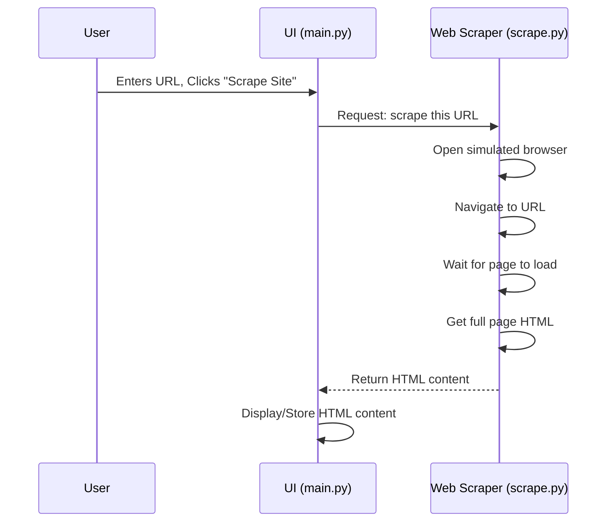

# 📗 Chapter 2: Web Scraper

Welcome back! In the last chapter, we explored the **Application Workflow & UI**— the control panel where you tell the AI Web Scraper what to do and see its results.

Now, what happens **right after** you click the **"Scrape Site"** button? That’s the spotlight of this chapter: the **Web Scraper** component.

## 💡 What Problem Does This Solve?

Imagine you want to read a book online. You use a browser like Chrome or Firefox to visit the site and see the pages.

Our AI Web Scraper needs something similar — but instead of looking, it needs to **programmatically get all the page’s content**: text, links, and structure — so the AI can analyze it later.

Just downloading the page’s initial file often isn’t enough because many modern sites load content dynamically with JavaScript after the page loads. We need a tool that behaves like a real browser, runs the scripts, and gets the fully rendered page.

## 🕵️‍♂️ What is the Web Scraper?
Think of the Web Scraper as your digital explorer:

- It acts like a browser that visits the URL you provide.

- It waits for the page to fully load, including any JavaScript.

- It grabs everything that makes up the page’s content — the full HTML source code.

- It sends this back to the UI so the next steps can analyze it.

## 🔑 Key Concepts

The Web Scraper relies on a few core ideas:

1. **Browser Simulation:** Uses tools to open the webpage like a real browser would — including running JavaScript.

2. **Raw Content Fetching:** Grabs the complete HTML source code after the page is fully loaded.

3. **Automation:** Does all this without any manual interaction — you give the URL, and it handles the rest.

## 🎯 How You Use It (From the UI Perspective)

You don’t interact with the Web Scraper directly. Instead:

1. Enter the URL into the UI’s input box.

2. Click "Scrape Site".

3. The UI calls the Web Scraper component behind the scenes.

4. The Web Scraper fetches the full page content and returns it.

5. The UI shows a message like "Scraping Done!" and can display the content for you.

## 🛠️ How it Works Inside (Implementation Details)

Let's peek under the hood to see what the Web Scraper component does. The code for this part lives mainly in the `scrape.py` file.

Here's a simplified sequence diagram focusing just on the scraping step from the overall workflow we saw in Chapter 1:




Let's look at the core part of the `scrape.py` code that performs the fetching:

```python
# --- File: scrape.py (simplified snippet) ---
from selenium.webdriver import Remote # Tool to control a browser remotely
from selenium.webdriver.chromium.remote_connection import ChromiumRemoteConnection
from selenium.webdriver import ChromeOptions # Options for our browser

# Details about where to find our special automated browser service
AUTH = "..." # (Authentication details hidden)
SBR_WEBDRIVER = f"https://{AUTH}@brd.superproxy.io:9515" # Address of the browser service

def scrape_website(website):
    print("Launching Chrome Browser.....") # Message printed to the console/logs

    # Set up the connection to the automated browser service
    sbr_connection = ChromiumRemoteConnection(SBR_WEBDRIVER, "goog", "chrome")

    # Use the Remote WebDriver to control the browser
    with Remote(sbr_connection, options=ChromeOptions()) as driver:
        print(f"Navigating to {website}...")
        driver.get(website) # *** This is the key step: Visit the URL! ***
        print("Page loaded. Getting HTML source...")
        html = driver.page_source # *** Get the full HTML content of the page ***
        print("Got HTML.")
        return html # Send the HTML back

# ... other functions like extract_body_content, clean_body_content, etc. are below...
```


**What’s Happening Here?**

- Selenium’s Remote WebDriver: Controls a browser running remotely (via a browser-as-a-service).

- driver.get(website): Opens the URL and waits for full page load (including JS).

- driver.page_source: Retrieves the final loaded page’s HTML source.

- The function returns this HTML back to the UI for further processing.


## 📌 Summary

- The Web Scraper acts like a browser to get fully loaded web page content.

- It solves the problem of dynamic, JavaScript-built websites.

- It runs automatically when you click "Scrape Site" in the UI.

- This step is the foundation for all the AI parsing and data extraction that follows.

### ⚙️ Next Steps
After fetching this raw HTML content, the app cleans and processes it before asking the AI to extract what you want.

We'll dive into this processing step in the next chapter:
👉 [Next Chapter: HTML Processor](03_html_processor_.md)