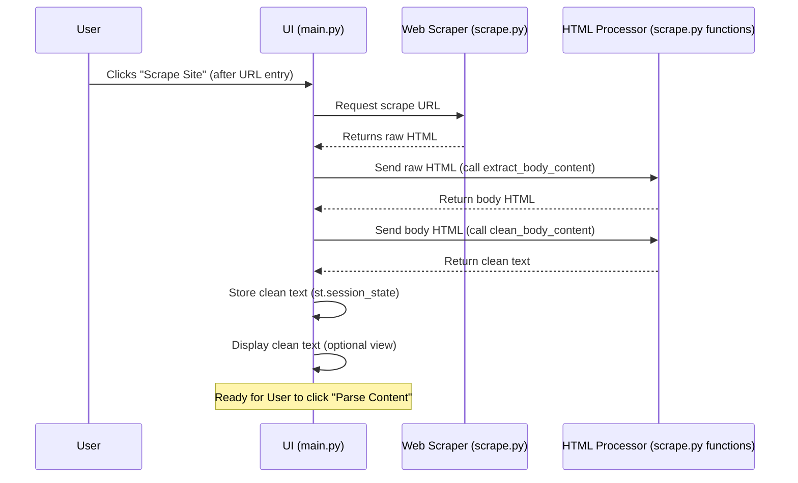

# Chapter 3: HTML Processor 🧹✨

Welcome back! In the last chapter, we explored how our Web Scraper grabs the raw HTML from a website — basically a messy jumble of code. Now, what do we do with that?

That’s where the **HTML Processor** comes in! Its job is to clean up the clutter and extract the main readable content — like the recipe, article, or story — from all the extra noise.

## Why Do We Need This? 🤔

Raw HTML includes:

- Navigation menus

- Ads

- `<script>` and `<style>` tags

- Hidden elements

- Tons of whitespace and blank lines

Trying to read just the important content in all that mess is like finding a needle in a haystack! The HTML Processor sifts through it all and leaves only what matters: the clean, human-readable text.

## How It Works 🔍

The HTML Processor works by focusing on a few key ideas:

1. **Parse HTML Structure:** We use BeautifulSoup to read the HTML like a tree — understanding how tags nest inside each other.

2. **Extract the `<body>` tag:** The main content usually lives inside the `<body>` section.

3. **Remove Noise:** Strip out `<script>, <style>,` and other unwanted tags.

4. **Clean the Text:** Remove extra spaces and blank lines so the text reads smoothly.

## Behind the Scenes ⚙️

Here’s the simplified flow after scraping:



## Code Highlights 🧑‍💻

### Extract body content:

```python
soup = BeautifulSoup(html_content, "html.parser")
body_content = soup.body
return str(body_content) if body_content else ""
```

### Remove scripts/styles and clean text:

```python
soup = BeautifulSoup(body_content, "html.parser")

for tag in soup(["script", "style"]):
    tag.extract()

cleaned_text = soup.get_text(separator="\n")
cleaned_text = "\n".join(line.strip() for line in cleaned_text.splitlines() if line.strip())

return cleaned_text

```

### How It Fits In main.py

```python
if st.button("Scrape Site"):
    raw_html = scrape_website(url)
    body_html = extract_body_content(raw_html)
    clean_text = clean_body_content(body_html)
    st.session_state.dom_content = clean_text
```


## Why This Matters 💡

Clean text is way easier for our AI to understand than raw HTML clutter. It lets the AI focus on the story, instructions, or data you actually want.

In the next chapter, we’ll handle long texts by chopping them into manageable chunks — because AI models have input size limits! 🪓📚

[Next Chapter: Content Chunking](04 content_chunking_.md)🚀
