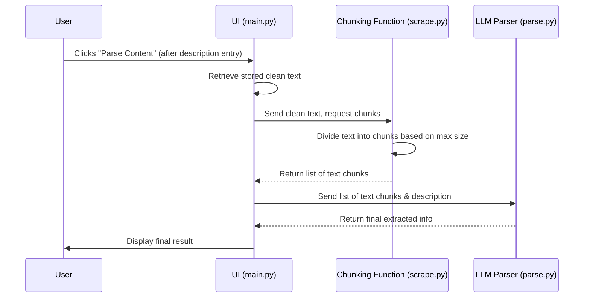

# Chapter 4: Content Chunking ✂️📄

Welcome back! In the last chapter, HTML Processor, we cleaned up messy HTML into neat, readable text. But what if the text is super long — like a whole book chapter or research paper? 🤯

Our AI can’t handle too much text at once because it has a limited “desk space” (called a **context window**). So, we need to chunk the text into smaller, manageable pieces before sending it to the AI.

## Why Content Chunking? 🤔

Imagine giving a reader a novel all at once and asking for a summary. Too much info at once! Content Chunking splits a long text into smaller bits, or chunks, that fit comfortably in the AI’s memory.

It’s like cutting a giant scroll into smaller sections, feeding them piece by piece. This way, the AI can understand everything without getting overwhelmed.

## Key Ideas 🧠 

1. **LLM Context Window:** The AI’s max input size, usually measured in tokens (words or parts of words). Our chunks must fit inside this.

2. **Max Chunk Size:** We set a character limit per chunk (e.g., 6000 chars).

3. **Sequential Splitting:** Simply slice the text into chunks of that max size one after another until the whole text is divided.

## How It Fits in the Workflow 🔄

Here’s what happens when you click Parse Content:

1. Clean text is retrieved from storage.

2. The UI sends the text to the Chunking Function.

3. The text is split into chunks.

4. The list of chunks is sent to the LLM Parser.

5. AI processes each chunk and returns the final info.

No extra clicks needed — it’s all automatic behind the scenes.



## How It Works Inside 🛠️

The heart of chunking is the `split_dom_content `function in `scrape.py`:

```python
def split_dom_content(dom_content, max_length=6000):
    """
    Splits a long string into smaller chunks, each max_length characters.
    """
    return [
        dom_content[i : i + max_length]
        for i in range(0, len(dom_content), max_length)
    ]
```

### What’s Happening?
- We take the big string `dom_content.`

- Using a list comprehension, we slice it into chunks of `max_length` characters.

- For example, `"abcdefghijklmnopqrstuvwxyz"` split with` max_length=10` gives:

    - `"abcdefghij"`

    - `"klmnopqrst"`

    - `"uvwxyz"`

This simple slicing ensures no chunk is too big for the AI.

In `main.py`, chunking happens just before parsing:

```python
if st.button("Parse Content"):
    if parse_description:
        st.write("Parsing the content...")
        dom_chunks = split_dom_content(st.session_state.dom_content)
        result = parse_with_ollama(dom_chunks, parse_description)
        st.write(result)
```


## Conclusion 🎉

Content Chunking is the smart way to handle long texts, breaking them down so the AI can read and understand them efficiently. It’s automatic, seamless, and essential for smooth parsing.

Now that our cleaned text is chunked, we’re ready for the next exciting step: feeding these chunks to the AI for deep understanding and extraction.

Ready to see the AI in action? Let’s dive into the next chapter!

[Next Chapter: LLM Parser](05_llm_parser_.md) 🤖
