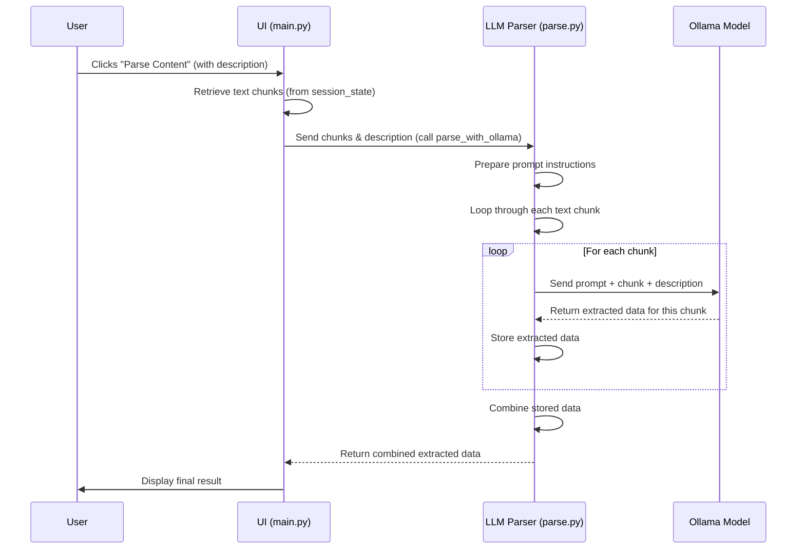

# Chapter 5: LLM Parser 🤖🔍

Welcome back! So far, you’ve learned how to:

- 🖱️ Use the UI and follow the app workflow

- 🌐 Fetch raw HTML with the `Web Scraper`

- 🧹 Clean it up with the `HTML Processor`

- ✂️ Break it into smaller pieces using `Content Chunking`

Now it's time for the smart part: LLM Parsing — where AI reads the chunks and pulls out exactly what you asked for.

## What Problem Does It Solve? 🧠

Say you want the price or the author from a long article. Keyword search? Meh. You’ll miss context or get the wrong match.

The **LLM Parser** understands your request and the content — like a clever detective 🕵️ — and extracts just the right data, no matter how it's worded.

## Key Concepts 📘

The LLM Parser relies on these key ideas:

1. **LLMs (Large Language Models):** AI models trained on tons of text (we use Ollama).

2. **Natural Language Understanding:** You describe what you want, like “Get the product price”, and the AI gets it.

3. **Prompting:** We give the AI a well-crafted instruction to guide its output.

4. **Chunk-wise Processing:** It reads each content chunk separately.

5. **Aggregation:** The app gathers results from each chunk to form one neat answer.

6. **LangChain:** A library that makes talking to LLMs easy in Python.

By combining these elements, the LLM Parser intelligently finds the precise information you need from the web content.

## How to Use It (UI View) 🧑‍💻

No extra steps. Just:

- Scrape & clean content as usual

- Type your request (e.g. “Extract the price.”)

- Click “Parse Content”

- That’s it! The AI goes to work and shows the result ✅

## What Happens Internally 🛠️



## Core Code Walkthrough 🧩

### **1. Prompt Template 💬**

```python
template = (
    "You are tasked with extracting specific information from: {dom_content} \n"
    "Instructions:\n"
    "1. Extract info based on: {parse_description}\n"
    "2. No extra text\n"
    "3. Return empty if nothing found\n"
    "4. Only return the exact data"
)
prompt = ChatPromptTemplate.from_template(template)
```
This tells the AI *what to do, what to look for, and how to respond*(strictly with data!).

### **2. Setting Up Ollama + LangChain 🔌**

```python
model = OllamaLLM(model="llama3.2:1b")
chain = prompt | model
```
This combo formats the prompt ➕ sends it to the AI model.

### **3. Parsing Each Chunk 🔁**

```python
def parse_with_ollama(dom_chunks, parse_description):
    parsed_results = []
    for chunk in dom_chunks:
        response = chain.invoke({
            "dom_content": chunk,
            "parse_description": parse_description
        })
        parsed_results.append(response)
    return "\n".join(parsed_results)
```
- Loops through all text chunks

- Sends each to the model with your request

- Collects and combines the results ✨

### **4. In main.py 🔧**

```python
if st.button("Parse Content"):
    result = parse_with_ollama(dom_chunks, parse_description)
    st.write(result)
```
One button. One AI. One perfect answer. ✅

## Conclusion 🎯

The LLM Parser is the brain 🧠 of your AI Web Scraper.

It uses smart prompting + powerful language models (via Ollama & LangChain) to read through cleaned, chunked content and pull out exactly what you asked for.

With just a short request like “Extract the product name”, the app processes everything in the background — no code, no confusion.

This wraps up the journey! 🎉 You now understand every piece of the pipeline: scraping ➡ cleaning ➡ chunking ➡ parsing.

Want to add an export or summary feature next? Let’s keep building! 💡


## 🙏 Thank You!
Thank you for following along this journey — from scraping a messy webpage all the way to extracting precise, AI-powered insights. We hope this tutorial not only helped you understand the inner workings of the AI Web Scraper but also sparked ideas for your own projects.

Your curiosity, creativity, and willingness to explore are what bring tools like this to life. Keep building, keep tinkering, and never stop asking “What else can I do with this?”

Happy scraping! 🚀
