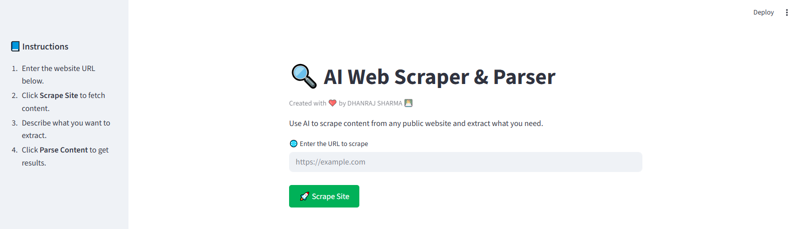
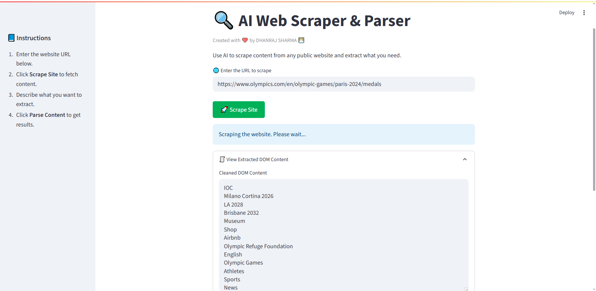
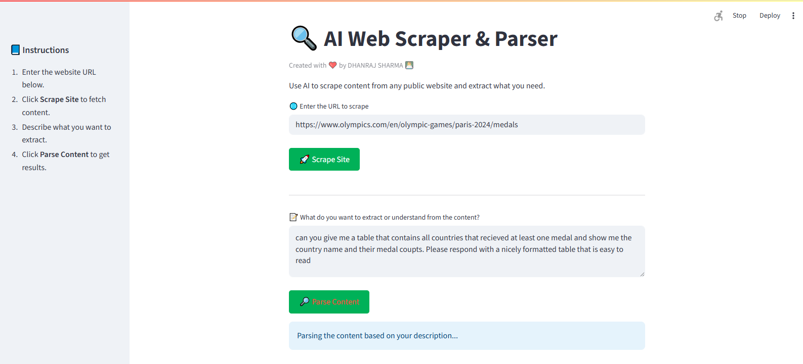
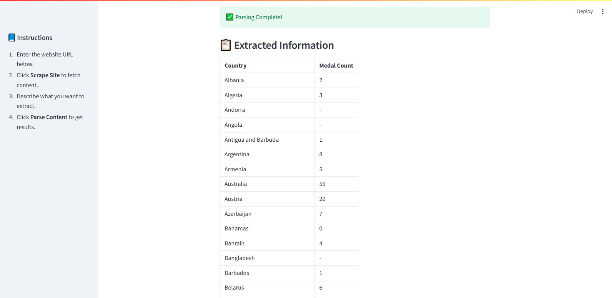
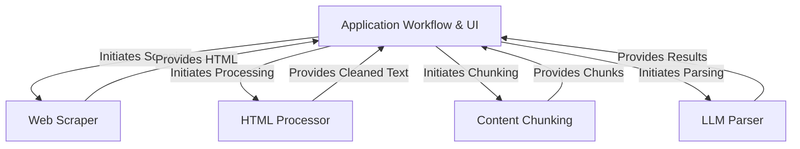

# **Tutorial: 🔍 AI Web Scraper & Parser**

This project is a tool that helps you automatically visit a *website*, fetch its content, and then uses *Artificial Intelligence* (AI) to find and pull out **exactly** the specific information you are looking for from that content. It does this through a simple user interface where you provide the website address and describe the data you want.

## **🖼️ Demo Preview (Screenshot)**
### ✨ Here's what the interface looks like in action!

### Extracting DOM Contents

### Giving Prompt to get desired information 

### AI Web Scraper giving the desired information

## **Visual Overview 🛠️**

## **Chapters 📌**

### 1. [Application Workflow & UI](DOC/01_application_workflow___ui_.md)
### 2. [Web Scraper](DOC/02_web_scraper_.md)
### 3. [HTML Processor](DOC/03_html_processor_.md)
### 4. [Content Chunking](DOC/04_content_chunking_.md)
### 5. [LLM Parser](DOC/05_llm_parser_.md)

## **🚀 Future Expansion: Build On Top!**
This project provides a solid, modular foundation for intelligent content extraction — but it's just the beginning. Want to expand it? Here are a few ideas:

- **🔄 Multi-page crawling:** Add logic to follow links and extract from multiple pages.

- **📄 Export formats:** Let users download results as CSV, JSON, or Markdown.

- **🧠 Structured parsing rules:** Allow predefined templates for common data types (e.g., product specs, blog summaries).

- **🌐 API access:** Wrap the app into an API so other tools can call it.

- **🧾 Document upload support:** Extend input sources beyond websites — like PDFs, DOCX, or pasted text.

- **🗃️ Storage & history:** Save previous results for comparison, tracking, or reuse.

The beauty of this architecture is its simplicity and flexibility. Each part (scraping, cleaning, chunking, parsing) is standalone — so you can swap in new models, plug in databases, or create entirely new user experiences without rewriting the core.

💡 Whether you're building a custom research assistant, price tracker, or legal document analyzer — this project is your launchpad.

## **🙌 Acknowledgements**
This project and guide were inspired by the excellent tutorial series by Tech With Tim. His breakdown of building an AI-powered web parser using Python and LLMs was incredibly helpful and shaped the foundation for this application. If you’re looking to deepen your knowledge or build your own AI tools, be sure to check out [Tech With Tim AI Web Scraper on YouTube.](https://www.youtube.com/watch?v=Oo8-nEuDBkk)🎓💻

